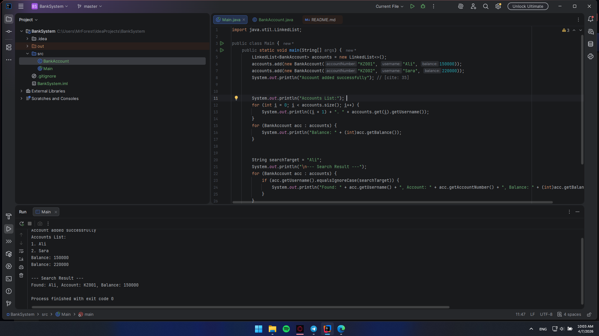
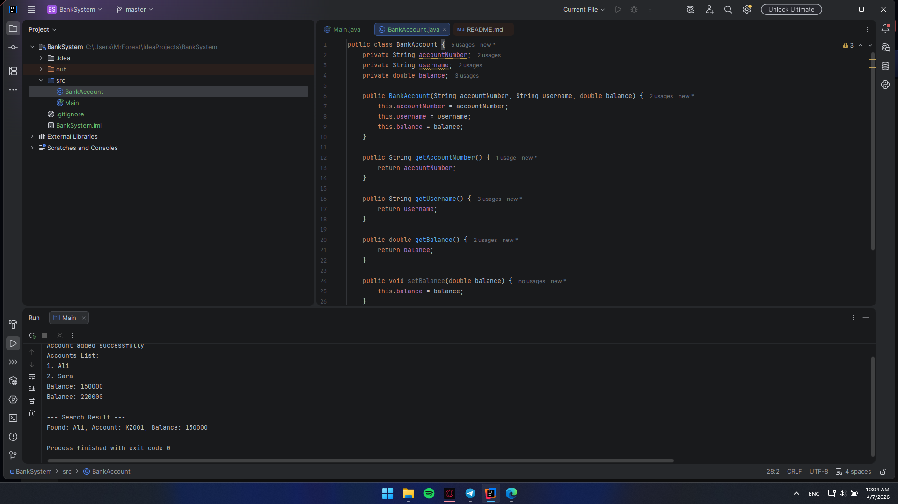
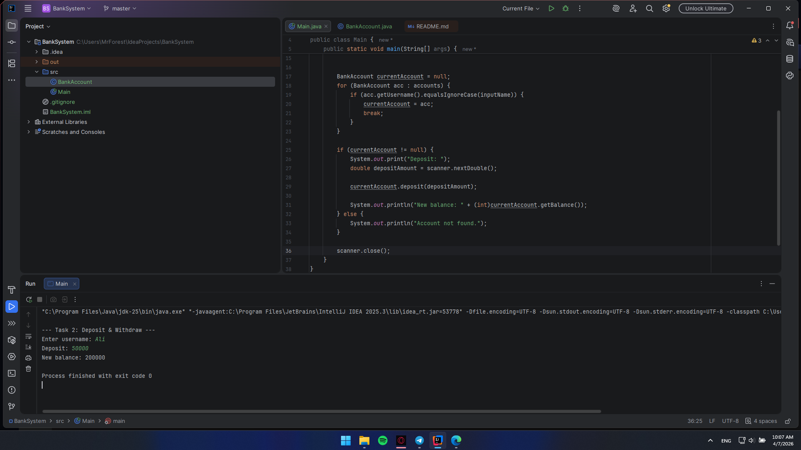
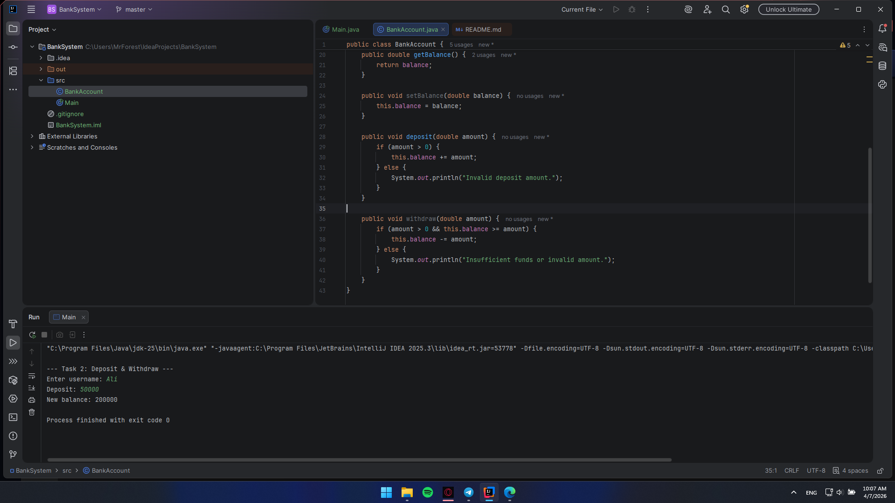
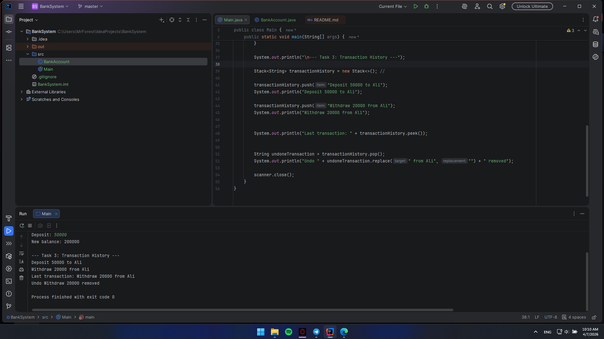
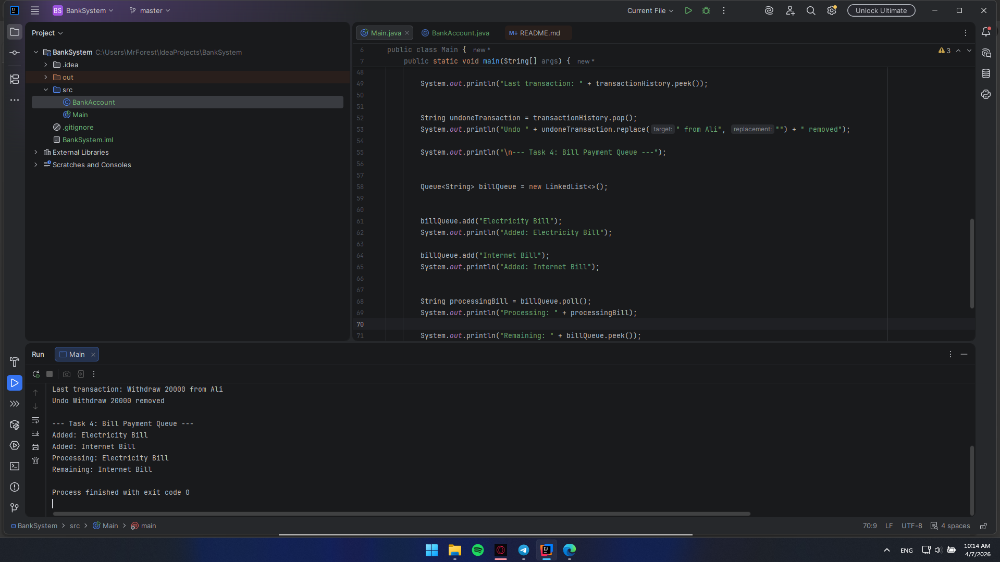
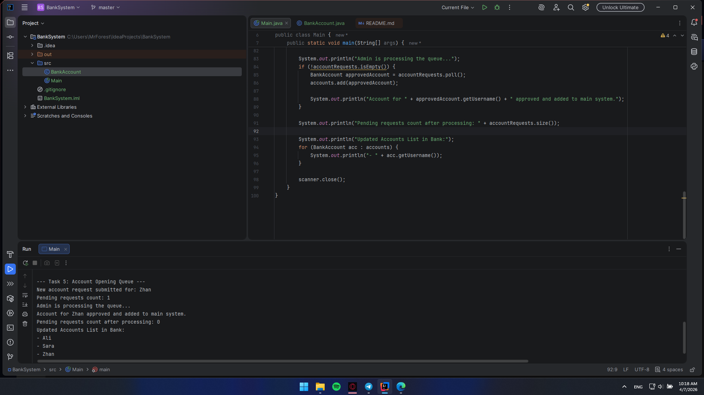
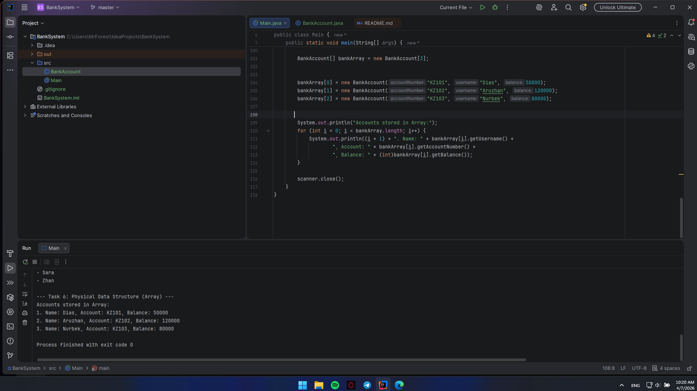
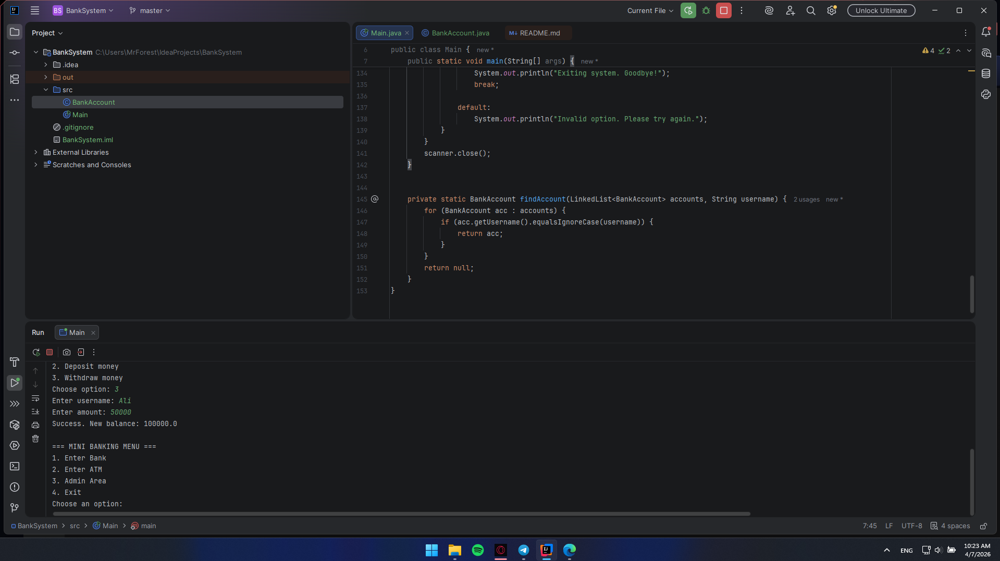

# Assignment 2: Physical & Logical Data Structures (Banking System)

**Student:** Kairbek Agzam
**Group:** SE25-13

## Brief summary of your work process
In this project, I developed a banking system simulation by applying various logical and physical data structures in Java. During the process, the following were implemented:
* `LinkedList` for dynamically storing the list of client accounts.
* `Stack` (LIFO) to save the transaction history and provide the ability to view or undo the last operation.
* `Queue` (FIFO) for processing the bill payment queue and simulating the moderation of new account opening requests.
* `Arrays` to demonstrate working with fixed-size physical data structures.

All these components were successfully integrated into a single console application with an interactive menu. One minor technical issue I encountered while building the final menu was handling the newline character (`\n`) after reading numbers via `Scanner.nextInt()`. This was successfully resolved by adding an empty `scanner.nextLine()` call to clear the buffer.

---
## Part 1. Logical Data Structures

### Task 1. Bank Account Storage Using LinkedList
Created the `BankAccount` class with the necessary encapsulated fields: `accountNumber`, `username`, and `balance`. A `LinkedList` is used to store active clients, implementing functions to add new accounts, display the full list, and search for a specific account by username.

### Task 2. Deposit & Withdraw Operations
Added methods to the `BankAccount` class for depositing and withdrawing funds. When operations are performed, the balance correctly updates directly within the objects inside the `LinkedList`.

### Task 3. Transaction History (Stack LIFO)
Implemented a `transactionHistory` stack to record actions (deposits, withdrawals). Demonstrated stack methods: adding a transaction (`push`), viewing the last operation without removing it (`peek`), and undoing it by removing it from the history (`pop`).

### Task 4. Bill Payment Queue (Queue FIFO)
Created a `billQueue` to process bill payment requests. New bills are added to the back of the queue, and the system processes them strictly from the front, demonstrating the FIFO principle.

### Task 5. Account Opening Queue (Admin Simulation)
Implemented an application moderation process: new users first go to the `accountRequests` waiting queue. The system administrator can process the first request in the queue, after which the account is extracted and transferred to the main database (the `LinkedList` from the first task).

## Part 2. Physical Data Structures

### Task 6. Predefined Accounts in Array
To demonstrate the operation of fixed-length physical data structures, an array of type `BankAccount` with 3 elements was created. The array was populated with predefined accounts and subsequently printed to the console.

## Part 3. Mini Banking Menu

### System Integration
All previously developed logical and physical data structures were combined into a single infinite loop menu.
* **Bank Menu:** Users can submit an account opening request (which goes to the queue) and deposit or withdraw money.
* **ATM Menu:** Implemented balance inquiry and cash withdrawal.
* **Admin Area:** The administrator has access to view and manually process both the account opening requests and bill payment queues.
