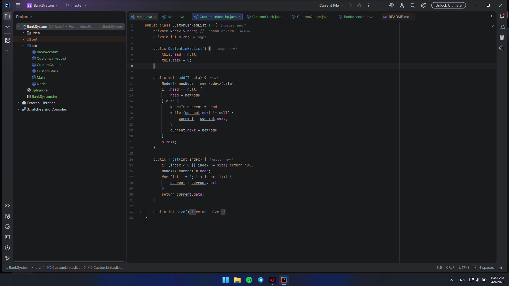
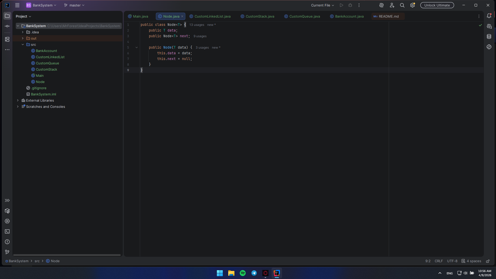
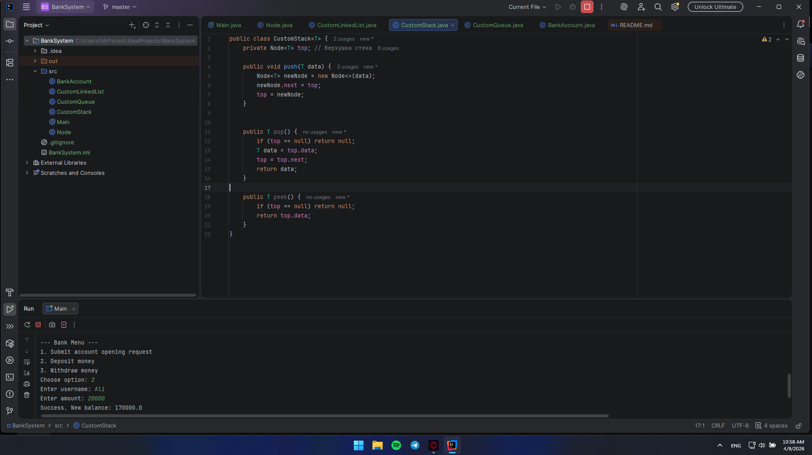
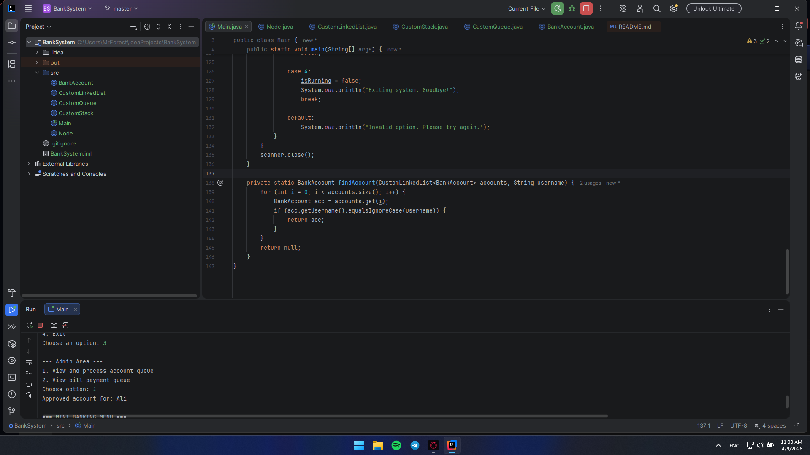
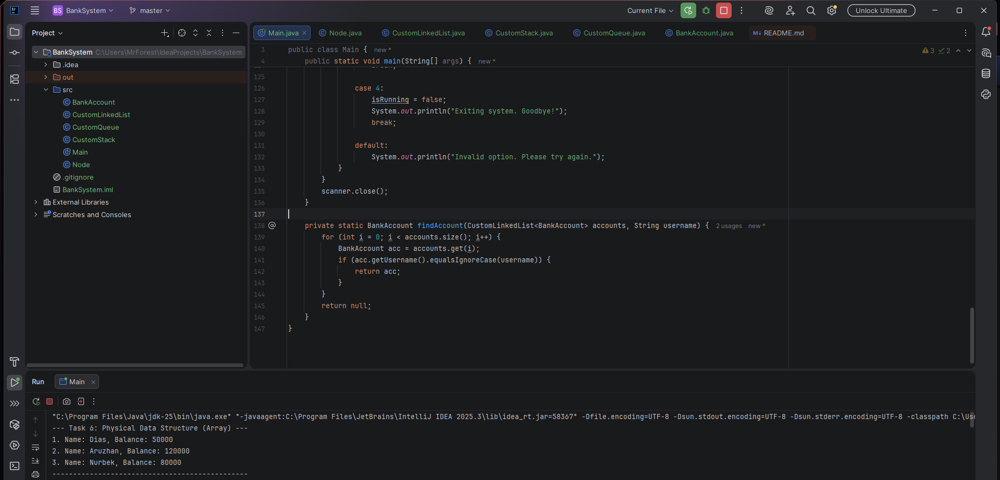
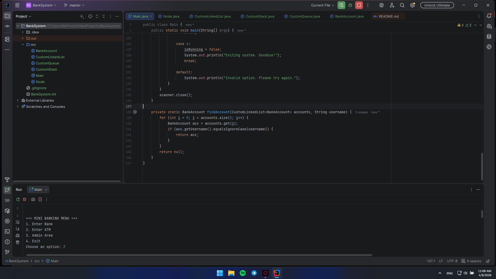

# Assignment 2: Physical & Logical Data Structures (Banking System)

**Student:** Kairbek Agzam
**Group:** SE25-13

## Brief summary of my work process
In this project, I developed a banking system simulation by implementing fundamental data structures **from scratch** in Java, completely avoiding standard Java Collections framework (java.util.*).

To achieve this, I created a generic `Node<T>` class to serve as the foundation for dynamic memory allocation. Based on this node architecture, I manually implemented:
* `CustomLinkedList` for dynamic account storage.
* `CustomStack` (LIFO) for transaction history tracking.
* `CustomQueue` (FIFO) for processing queues.

This approach provided a deeper understanding of how memory references, pointers, and data structure algorithms work under the hood. All components were integrated into an interactive console-based banking menu.

---

## Part 1. Logical Data Structures

### Task 1. Bank Account Storage Using Custom LinkedList
Created the `BankAccount` class with encapsulated fields (`accountNumber`, `username`, `balance`). Instead of standard lists, I implemented a `CustomLinkedList<T>` using manual node traversal to add new accounts and search for specific users.

### Task 2. Deposit & Withdraw Operations
Added business logic methods to the `BankAccount` class for depositing and withdrawing funds. The balance correctly updates directly within the objects stored inside the custom linked list.

### Task 3. Transaction History (Custom Stack LIFO)
Implemented a `CustomStack<T>` class from scratch using node pointers targeting the "top" element. This stack is used to record transaction events (deposits/withdrawals) dynamically.

### Task 4. Bill Payment Queue (Custom Queue FIFO)
Created a `CustomQueue<T>` utilizing `front` and `rear` node pointers to maintain O(1) time complexity for adding items. This queue successfully simulates a FIFO bill payment system.
[img_14.png](img_14.png)

### Task 5. Account Opening Queue (Admin Simulation)
Implemented an application moderation workflow: new user requests are pushed into a `CustomQueue<BankAccount>`. The system administrator can poll the first request from the queue, extracting the account and transferring it to the main `CustomLinkedList` database.

---

## Part 2. Physical Data Structures

### Task 6. Predefined Accounts in Array
To demonstrate the contrast between dynamic node-based structures and fixed-length physical memory allocation, an array `BankAccount[3]` was initialized. It was populated with predefined data and parsed efficiently.

---

## Part 3. Mini Banking Menu

### System Integration
All custom-built data structures were combined into a single infinite loop routing system using `Scanner`.
* **Bank Menu:** Users can request new accounts and perform transactions.
* **ATM Menu:** Quick access for balance inquiries and cash withdrawals.
* **Admin Area:** Secure area for polling queues and approving accounts/bills.

